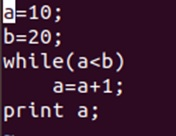
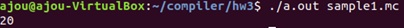
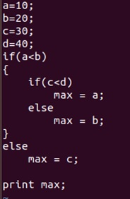
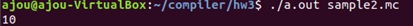
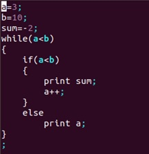
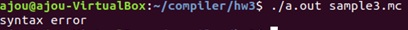

# Interpreter

## 개요
flex와 bison을 이용한 interpreter를 개발한다. 인터프리터는 두 단계로 실행 된다.
- 1단계 : 단위(문장)별로 코드를 syntax tree로 변경
- 2단계 : syntax tree를 이용하여 실행한 후 그 결과를 출력

## 사용된 환경 & version
- Ubuntu 18.04.1 LTS (64bit)
- gcc (Ubuntu 7.4.0-1ubuntu1~18.04.1) 7.4.0
- flex 2.6.4
- bison (GNU Bison) 3.0.4

## 사용 시 주의사항

**입력및실행**

```bash
make
./a.out sample1.mc
./a.out sample2.mc
./a.out sample3.mc
```

**make로 생성 된 object 파일 삭제**

```bash
make clean
```

**flex가 설치되어 있지 않을 때 설치 및 version확인 방법**

```bash
sudo apt-get install flex -y
flex --version
```

**bison이 설치되어 있지 않을 때 설치 및 version확인 방법**

```bash
sudo apt-get install bison -y
bison --version
```

## 기능 설명

- 상수
    - 정수형 상수(int)와 실수형 상수(double)를 지원한다.
    - double은 normal한 형태만 지원한다.

- 변수
    - 변수는 기본적으로 선언하지 않고 사용한다.
    - 변수의 type은 저장되는 값에 의해 결정된다. 실행시 변경도 가능하다.
    - 변수에 값을 저장하지 않고 사용할 수 있으나 값을 예측할 수 없다.
    - ex) i = 10; // 변수 i는 int형
    - ex) i=3.4; // 변수 i는 double형으로 변경

- 수식(expression)과 연산자
    - 가감승제 연산자('+', '-', '*', '/') - 비교 연산 ('>', '>=', '<', '<=', '==', '!=')
    - assignment 연산자(=)
    - 정수, 실수 혼합식은 실수로 형을 변환함

- 문장
    - 수식문장(expression statement)
        - 수식에 ';'를 넣어 문장을 만든다.
        - ex) sum = 0;  sum = sum + i;
    - if문
        - **if** (*exp*)
                *statement*
          **else**
                *statement*
    - while문
        - **while** (*exp*) *statement*
    - 출력문
        - **print** *exp;*      **//exp의 계산 결과를 화면에 출력함**
        - ex) print 10;
        - print a*b;
        - print a=b;  **//b를 a에 저장한 후 그 결과인 a를 출력**
    - block문
        - *{statement_list}*


## 입력및출력 예시

- sample1.mc





- sample2.mc





- sample3.mc




